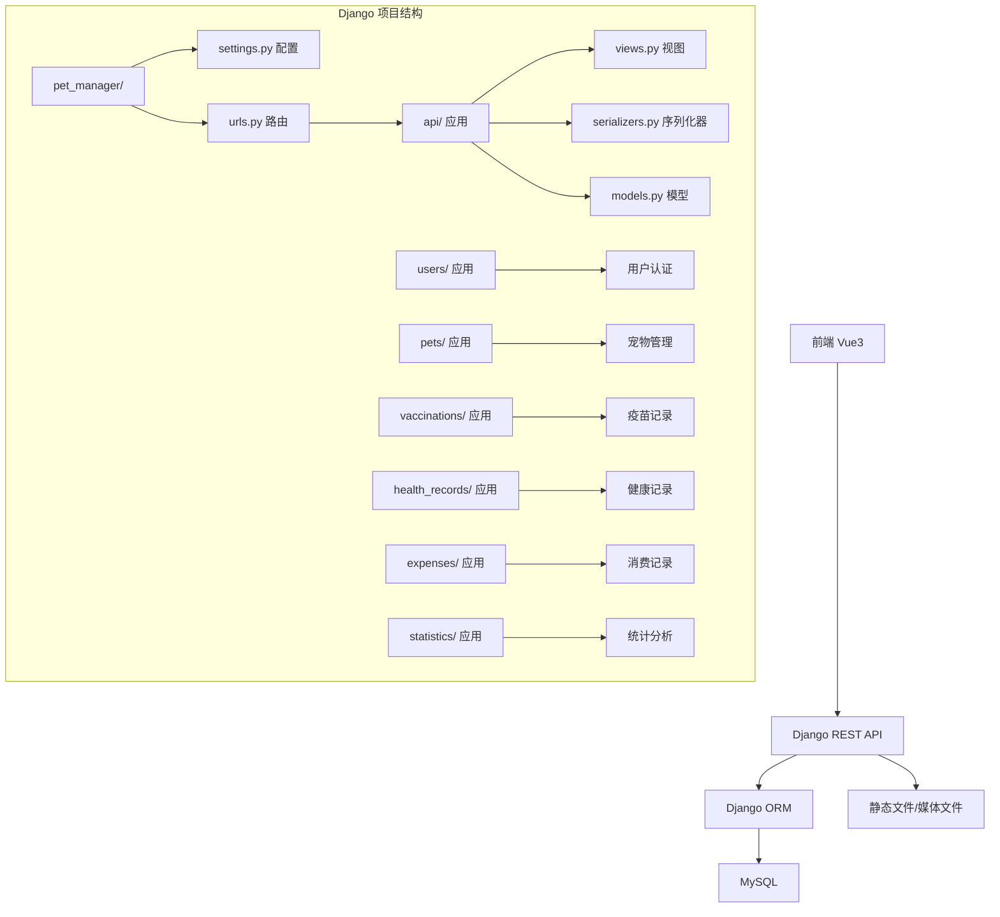

# Django 重构计划

## 1. 项目概述

将现有的 FastAPI 后端项目完全重构为 Django + Django REST Framework (DRF)。

### 技术栈

| 技术 | 原项目 | 重构后 |
|------|--------|--------|
| Web 框架 | FastAPI 0.104.1 | Django 5.0 + DRF |
| ORM | SQLAlchemy 2.0 | Django ORM |
| 数据库 | MySQL 8.0+ | MySQL 8.0+ (保持不变) |
| 认证 | JWT (python-jose) | JWT (djangorestframework-simplejwt) |
| 任务队列 | Celery | Django Q 或保持 Celery |
| 验证 | Pydantic | Django Serializer |

### 项目结构



## 2. API 接口映射

保持与现有 FastAPI 相同的 API 路由结构，确保前端无需修改。

| 模块 | 原 FastAPI 路由 | 重构后 Django 路由 |
|------|----------------|-------------------|
| 认证-登录 | POST /api/auth/login | POST /api/auth/login/ |
| 认证-注册 | POST /api/auth/register | POST /api/auth/register/ |
| 认证-刷新令牌 | POST /api/auth/refresh-token | POST /api/auth/refresh/ |
| 用户-详情 | GET /api/user/profile | GET /api/user/profile/ |
| 用户-更新 | PUT /api/user/profile | PUT /api/user/profile/ |
| 用户-改密 | PUT /api/user/password | PUT /api/user/password/ |
| 宠物-列表 | GET /api/pets | GET /api/pets/ |
| 宠物-详情 | GET /api/pets/{id} | GET /api/pets/{id}/ |
| 宠物-创建 | POST /api/pets | POST /api/pets/ |
| 宠物-更新 | PUT /api/pets/{id} | PUT /api/pets/{id}/ |
| 宠物-删除 | DELETE /api/pets/{id} | DELETE /api/pets/{id}/ |
| 疫苗-列表 | GET /api/vaccinations | GET /api/vaccinations/ |
| 疫苗-详情 | GET /api/vaccinations/{id} | GET /api/vaccinations/{id}/ |
| 疫苗-创建 | POST /api/vaccinations | POST /api/vaccinations/ |
| 疫苗-更新 | PUT /api/vaccinations/{id} | PUT /api/vaccinations/{id}/ |
| 疫苗-删除 | DELETE /api/vaccinations/{id} | DELETE /api/vaccinations/{id}/ |
| 健康记录-列表 | GET /api/health-records | GET /api/health-records/ |
| 健康记录-详情 | GET /api/health-records/{id} | GET /api/health-records/{id}/ |
| 健康记录-创建 | POST /api/health-records | POST /api/health-records/ |
| 健康记录-更新 | PUT /api/health-records/{id} | PUT /api/health-records/{id}/ |
| 健康记录-删除 | DELETE /api/health-records/{id} | DELETE /api/health-records/{id}/ |
| 消费-列表 | GET /api/expenses | GET /api/expenses/ |
| 消费-详情 | GET /api/expenses/{id} | GET /api/expenses/{id}/ |
| 消费-创建 | POST /api/expenses | POST /api/expenses/ |
| 消费-更新 | PUT /api/expenses/{id} | PUT /api/expenses/{id}/ |
| 消费-删除 | DELETE /api/expenses/{id} | DELETE /api/expenses/{id}/ |
| 统计-仪表盘 | GET /api/statistics/dashboard | GET /api/statistics/dashboard/ |
| 统计-疫苗提醒 | GET /api/statistics/upcoming-vaccinations | GET /api/statistics/upcoming-vaccinations/ |
| 统计-近期健康 | GET /api/statistics/recent-health-records | GET /api/statistics/recent-health-records/ |

## 3. 数据模型迁移

### User (用户)

```python
# Django Models
class User(AbstractUser):
    phone = models.CharField(max_length=20, blank=True, verbose_name="手机号码")
    avatar = models.ImageField(upload_to='avatars/', blank=True, verbose_name="头像")
    created_at = models.DateTimeField(auto_now_add=True, verbose_name="创建时间")
    updated_at = models.DateTimeField(auto_now=True, verbose_name="更新时间")
```

### Pet (宠物)

```python
class Pet(models.Model):
    owner = models.ForeignKey(User, on_delete=models.CASCADE, related_name='pets')
    name = models.CharField(max_length=50, verbose_name="宠物名称")
    breed = models.CharField(max_length=100, blank=True, verbose_name="品种")
    gender = models.CharField(max_length=10, blank=True, verbose_name="性别")
    birth_date = models.DateField(null=True, blank=True, verbose_name="出生日期")
    weight = models.FloatField(null=True, blank=True, verbose_name="体重(kg)")
    color = models.CharField(max_length=50, blank=True, verbose_name="毛色")
    chip_number = models.CharField(max_length=50, blank=True, verbose_name="芯片号")
    description = models.TextField(blank=True, verbose_name="特征描述")
    personality = models.TextField(blank=True, verbose_name="性格特点")
    avatar = models.ImageField(upload_to='pets/', blank=True, verbose_name="宠物头像")
    is_active = models.BooleanField(default=True, verbose_name="是否有效")
    created_at = models.DateTimeField(auto_now_add=True)
    updated_at = models.DateTimeField(auto_now=True)
```

### Vaccination (疫苗记录)

```python
class Vaccination(models.Model):
    pet = models.ForeignKey(Pet, on_delete=models.CASCADE, related_name='vaccinations')
    vaccine_name = models.CharField(max_length=100, verbose_name="疫苗名称")
    vaccination_date = models.DateField(verbose_name="接种日期")
    next_due_date = models.DateField(null=True, blank=True, verbose_name="下次接种日期")
    clinic = models.CharField(max_length=100, blank=True, verbose_name="接种单位")
    doctor = models.CharField(max_length=50, blank=True, verbose_name="医生姓名")
    batch_number = models.CharField(max_length=50, blank=True, verbose_name="疫苗批次号")
    remark = models.TextField(blank=True, verbose_name="备注")
    attachment = models.FileField(upload_to='vaccinations/', blank=True, verbose_name="附件")
    is_reminded = models.BooleanField(default=False, verbose_name="是否已提醒")
    created_at = models.DateTimeField(auto_now_add=True)
    updated_at = models.DateTimeField(auto_now=True)
```

### HealthRecord (健康记录)

```python
class HealthRecord(models.Model):
    RECORD_TYPES = [
        ('就诊', '就诊'),
        ('体检', '体检'),
        ('体重', '体重'),
        ('驱虫', '驱虫'),
        ('过敏', '过敏'),
        ('手术', '手术'),
        ('其他', '其他'),
    ]
    
    pet = models.ForeignKey(Pet, on_delete=models.CASCADE, related_name='health_records')
    record_type = models.CharField(max_length=20, choices=RECORD_TYPES, verbose_name="记录类型")
    record_date = models.DateField(verbose_name="记录日期")
    title = models.CharField(max_length=200, verbose_name="标题")
    content = models.TextField(blank=True, verbose_name="详细内容")
    hospital = models.CharField(max_length=100, blank=True, verbose_name="医院名称")
    doctor = models.CharField(max_length=50, blank=True, verbose_name="医生姓名")
    cost = models.FloatField(null=True, blank=True, verbose_name="费用")
    attachment = models.FileField(upload_to='health_records/', blank=True, verbose_name="附件")
    next_check_date = models.DateField(null=True, blank=True, verbose_name="下次复查日期")
    created_at = models.DateTimeField(auto_now_add=True)
    updated_at = models.DateTimeField(auto_now=True)
```

### Expense (消费记录)

```python
class Expense(models.Model):
    CATEGORIES = [
        ('food', '食物'),
        ('medical', '医疗'),
        ('grooming', '美容'),
        ('supplies', '用品'),
        ('insurance', '保险'),
        ('other', '其他'),
    ]
    
    pet = models.ForeignKey(Pet, on_delete=models.CASCADE, related_name='expenses')
    category = models.CharField(max_length=20, choices=CATEGORIES, verbose_name="消费分类")
    expense_date = models.DateField(verbose_name="消费日期")
    amount = models.FloatField(verbose_name="金额")
    merchant = models.CharField(max_length=100, blank=True, verbose_name="商家名称")
    remark = models.TextField(blank=True, verbose_name="备注")
    attachment = models.FileField(upload_to='expenses/', blank=True, verbose_name="小票/凭证")
    created_at = models.DateTimeField(auto_now_add=True)
    updated_at = models.DateTimeField(auto_now=True)
```

## 4. 认证方案

使用 `djangorestframework-simplejwt` 实现 JWT 认证：

```python
# settings.py 配置
REST_FRAMEWORK = {
    'DEFAULT_AUTHENTICATION_CLASSES': [
        'rest_framework_simplejwt.authentication.JWTAuthentication',
    ],
    'DEFAULT_PERMISSION_CLASSES': [
        'rest_framework.permissions.IsAuthenticated',
    ],
}

SIMPLE_JWT = {
    'ACCESS_TOKEN_LIFETIME': timedelta(minutes=30),
    'REFRESH_TOKEN_LIFETIME': timedelta(days=7),
    'ROTATE_REFRESH_TOKENS': True,
}
```

### Token 响应格式适配

由于前端期望的 Token 响应格式为：
```json
{
    "access_token": "xxx",
    "refresh_token": "xxx", 
    "token_type": "bearer",
    "expires_in": 1800
}
```

需要创建自定义 Token 视图来适配此格式。

## 5. 实施步骤

### 第一阶段：项目基础搭建

1. 创建 Django 项目结构
2. 配置 settings.py（数据库、CORS、静态文件、JWT等）
3. 创建 requirements.txt
4. 配置 .env 环境变量

### 第二阶段：用户认证模块

1. 创建 users 应用
2. 实现自定义用户模型
3. 实现注册、登录、刷新令牌接口
4. 实现用户资料查看和修改接口

### 第三阶段：核心业务模块

1. 创建 pets 应用（含宠物 CRUD）
2. 创建 vaccinations 应用（含疫苗 CRUD）
3. 创建 health_records 应用（含健康记录 CRUD）
4. 创建 expenses 应用（含消费记录 CRUD）

### 第四阶段：统计模块

1. 创建 statistics 应用
2. 实现仪表盘统计数据接口
3. 实现疫苗到期提醒接口
4. 实现近期健康记录接口

### 第五阶段：配置和部署

1. 配置静态文件和媒体文件上传
2. 配置 CORS 允许前端访问
3. 配置 URL 路由保持兼容
4. 测试和验证

## 6. 依赖包

```
Django>=5.0
djangorestframework>=3.14
djangorestframework-simplejwt>=5.3
mysqlclient>=2.2
python-dotenv>=1.0
django-cors-headers>=4.3
Pillow>=10.0  # 图片处理
gunicorn>=21.2
```

## 7. 注意事项

1. **API 兼容性**：确保所有接口路径、请求参数、响应格式与原 FastAPI 完全一致
2. **认证方式**：保持 JWT 认证，前端 token 存储方式不变
3. **文件上传**：使用 Django 的媒体文件处理机制
4. **数据迁移**：如需保留数据，可使用 Django Migration 或数据导入脚本
5. **错误响应格式**：保持统一的错误响应格式